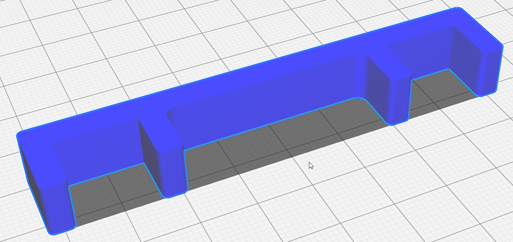
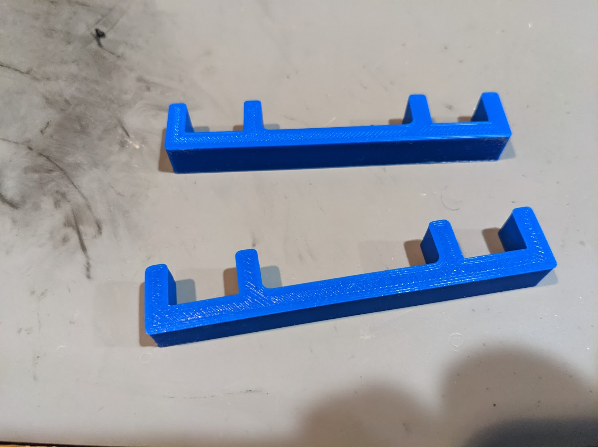
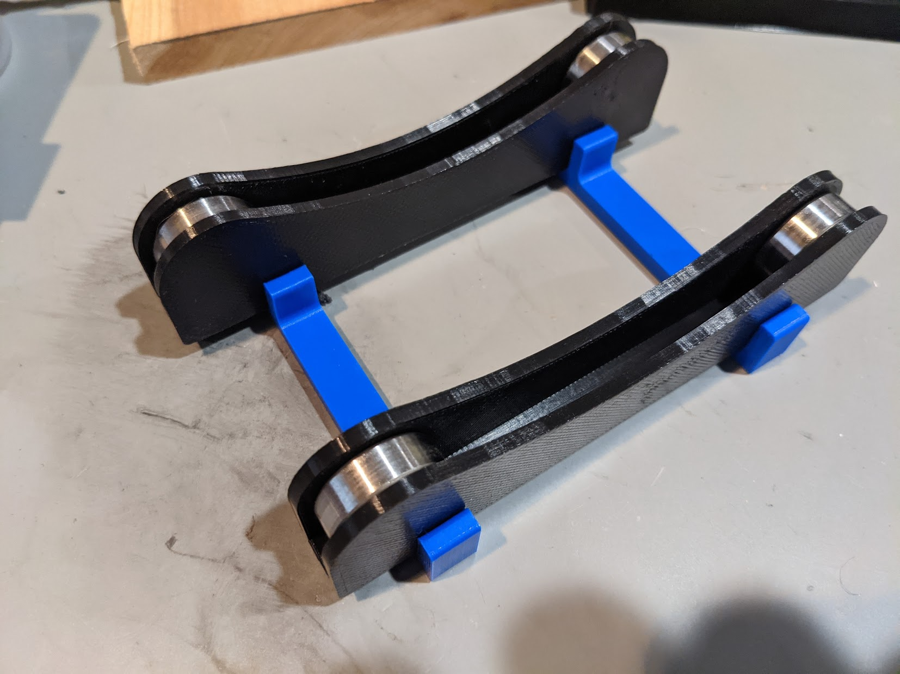

# TUSH Rack Spacer

This is a spacer holds the TUSH bearing slides to a reasonable spacing for my Inland spools

# Changelog

2021/01/24 - Add photos and readme

## Note

Thingiverse search sucks and I wasn't able to find what I was looking for.  Later found tons of adjustable designs.  This one is in my plastic scrap pile, it would move around too much and too easily.

## Design

Autocad Fusion 360 

## Slicer

Ultimaker Cura 4.8.0
- Printer: Creality CR6 SE
- Layer Height: 0.2mm
- Infill Density: 20%
- Infill Pattern: Grid
- Filament: Inland PLA+ 1.75mm Blue
- Material: PLA+
- Print Temperature: 215 degrees C

# Associated Thingiverse

[TUSH - The Ultimate Spool Holder by terrago](http://www.thingiverse.com/thing:2047554)
 
# Preview

